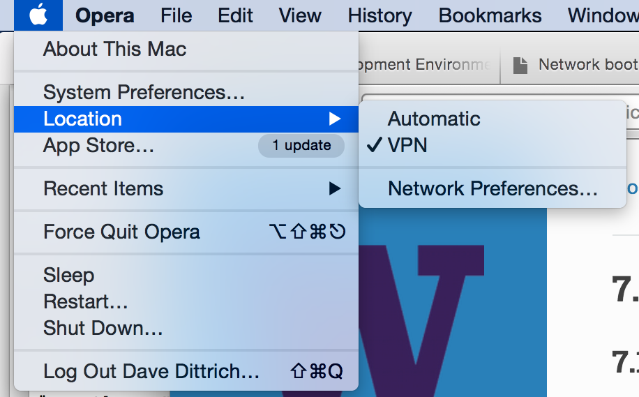
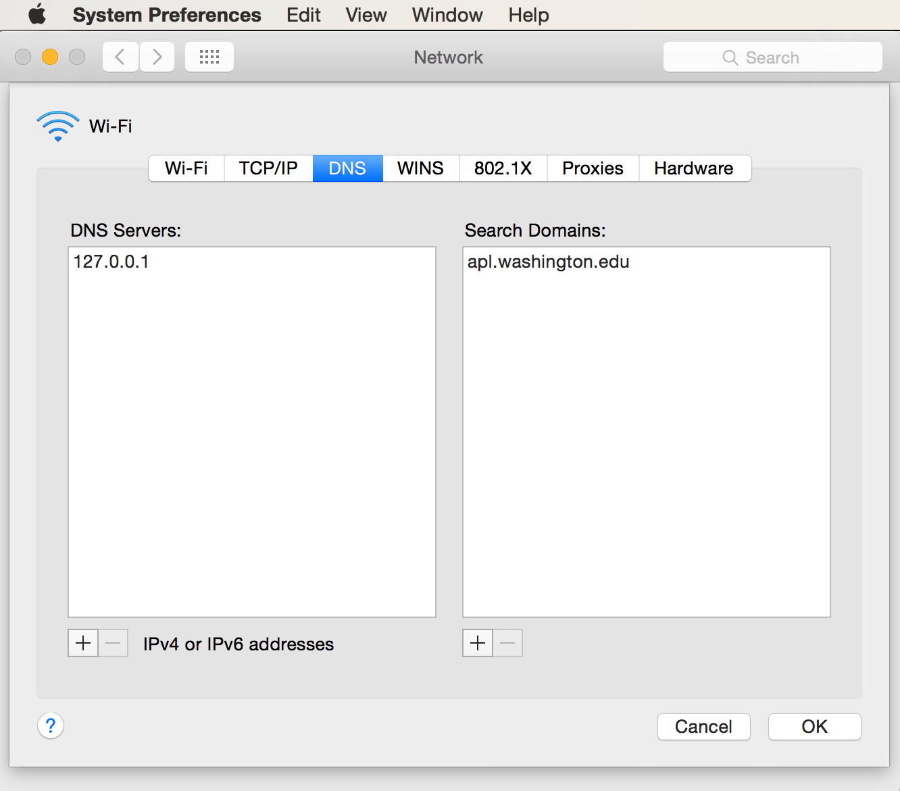

.. _appendices:

Appendices
==========

.. _setupdnsmasq:

Setting up DNS using dnsmasq
----------------------------

DNS is designed to be a distributed, hierarchical, system of
mapping names to IP addresses (and the reverse, IP addresses
to names).

.. note::

   To learn more about it, see:

       #. `How the Domain Name System (DNS) Works`_, by Verisign

       #. `How does DNS work?`_, by D.J. Berstein

       #. `The Domain Name System`_, Wikipedia

..

.. _How the Domain Name System (DNS) Works: http://www.verisigninc.com/en_US/domain-names/online/how-dns-works/index.xhtml
.. _How does DNS work?: http://cr.yp.to/djbdns/intro-dns.html
.. _The Domain Name System: https://en.wikipedia.org/wiki/Domain_Name_System

The important thing to note is that if you only have one DNS
server set, and that server only serves it's own names and does
not make recursive queries for domains it does not know, you
will not be able to talk to many hosts on the internet.

These instructions will configure ``dnsmasq`` on a developer's
workstation (e.g., a laptop computer) to serve as the primary
DNS server for that system, using a local DNS server behind a
VPN (when connected to the VPN) or recursively directing queries
to Google's name servers for all other DNS requests. This should
work for any DNS requests made from this client system in a
reliable way.

.. _macosxdnsconfig:

Mac OS X configuration
~~~~~~~~~~~~~~~~~~~~~~

.. attention::

    The following instructions are partially specific to Mac OS X,
    which handles network configuration using **System Preferences...*

..

Start by creating a *Location* called *VPN" to use for
controlling the DNS configuration of the Mac. Figure
:ref:`networklocation` shows the location *VPN* enabled.

.. _networklocation:

   Mac OS X Network Preferences, Location

..

Figure :ref:`networkpreferences` shows the settings
for *DNS Server* and *Search*. Set *DNS Server* to
only be ``127.0.0.1`` for force all DNS queries to
*only* go to the local ``dnsmasq`` server. The *Search*
list should include your normal domain that you want
to be appended to any short (or *partially qualified*)
DNS names.

.. _networkpreferences:

   Mac OS X Network Preferences, DNS

..

When set this way, as soon as the network is enabled on any
interface (be it WiFi, Bluetooth, USB ethernet, or wired
ethernet), the *VPN* location will be enabled and the host's
``/etc/resolv.conf`` file will be set to look like this:

.. code-block:: bash

    #
    # Mac OS X Notice
    #
    # This file is not used by the host name and address resolution
    # or the DNS query routing mechanisms used by most processes on
    # this Mac OS X system.
    #
    # This file is automatically generated.
    #
    search apl.washington.edu
    nameserver 127.0.0.1

..

Edit the ``dnsmasq`` configuration file (``/opt/local/etc/dnsmasq.conf``
on the Mac, and ``/etc/dnsmasq.conf`` on Ubuntu 14.04). Set the following
variables as shown in the examples.

#. Add a line referencing an alternative ``resolve.conf`` file to
   control upstream DNS servers.

    .. code-block:: bash

        # Change this line if you want dns to get its upstream servers from
        # somewhere other that /etc/resolv.conf
        #resolv-file=/etc/resolv.conf
        resolv-file=/etc/resolv.dnsmasq

    ..

#. Set the ``server`` entries for forward lookups containing the top level
   domain ``prisem.washington.edu`` and reverse maps for the DIMS VPN network
   range (``192.168.88.0/24``, which is expressed as
   ``88.168.192.in-addr.arpa`` for DNS reverse mappings) as shown in the
   highlighted lines here:

   .. code-block:: bash
       :emphasize-lines: 4,5,10

       # Add other name servers here, with domain specs if they are for
       # non-public domains.
       #server=/localnet/192.168.0.1
       server=/prisem.washington.edu/192.168.88.101
       server=/dims-dev.prisem.washington.edu/127.0.0.1

       # Example of routing PTR queries to nameservers: this will send all
       # address->name queries for 192.168.3/24 to nameserver 10.1.2.3
       #server=/3.168.192.in-addr.arpa/10.1.2.3
       server=/88.168.192.in-addr.arpa/192.168.88.101

   ..

   .. note::

       The second ``server`` line in the first set above creates a test
       domain ``dims-dev.prisem.washington.edu`` that is served by this
       ``dnsmasq`` server on the local host address. This allows you to
       test services running on the loopback interface.

   ..

   .. attention::

       Mac users will need to configure ``dnsmasq`` to run under
       ``_mdnsresponder`` account. Use the following lines:

       .. code-block:: bash

           # If you want dnsmasq to change uid and gid to something other
           # than the default, edit the following lines.
           user=_mdnsresponder
           group=_mdnsresponder

       ..

   ..

#. If you also have a home network that you wish to associate with a specific
   alternative domain, use the ``domain`` setting as shown here:

   .. code-block:: bash

       # Set a different domain for a particular subnet
       #domain=wireless.thekelleys.org.uk,192.168.2.0/24
       domain=home,192.168.1.0/24

   ..

#. 
   
   .. caution::

       When switching a VPN connection on and off, where you are trying to use
       non-public DNS names served by a server behind the VPN, you may encounter a
       situation where queries for a non-public domain are sent to public DNS
       servers, which will return an "NXDOMAIN" response, which looks like this

       .. code-block:: bash

           Host abcquq12examfooltest.com not found: 3(NXDOMAIN)

       ..

       The local server may cache this result. When you then connect
       to the VPN and regain access to the private server which should
       be able to now respond with the correct result, your next attempt
       to resolve the domain may find the cached NXDOMAIN result
       and tell you the domain still does not exist (when you are assuming
       that it does, since the VPN is now up.) This is both confusing,
       and frustrating, unless you are aware of how DNS caching works.

       To prevent this problem, disable negative caching as follows:

       .. code-block:: bash

           # If you want to disable negative caching, uncomment this.
           no-negcache

       ..

#.

   .. attention::

       As a debugging mechanism, you may need to enable logging of
       DNS queries and/or DHCP transactions. Do that by uncommenting
       the following lines:

       .. code-block:: bash

           # For debugging purposes, log each DNS query as it passes through
           # dnsmasq.
           log-queries

           # Log lots of extra information about DHCP transactions.
           log-dhcp

       ..

   ..

#. Create the alternative ``resolv.conf`` file referenced in the
   ``dnsmasq.conf`` file above to have the contents shown here:

   .. code-block:: bash

       [dittrich@localhost etc]$ cat resolv.dnsmasq 
       search prisem.washington.edu apl.washington.edu
       nameserver 8.8.8.8
       nameserver 192.168.88.101
       nameserver 128.95.120.1

   ..

#. Test the configuration.
  
   With VPN disconnected:

   .. code-block:: bash

       [dittrich@localhost etc]$ dig @127.0.0.1 jira.prisem.washington.edu

       ; <<>> DiG 9.8.3-P1 <<>> @127.0.0.1 jira.prisem.washington.edu
       ; (1 server found)
       ;; global options: +cmd
       ;; connection timed out; no servers could be reached

   ..

   With VPN enabled:

   .. code-block:: bash

       [dittrich@localhost etc]$ dig @127.0.0.1 jira.prisem.washington.edu

       ; <<>> DiG 9.8.3-P1 <<>> @127.0.0.1 jira.prisem.washington.edu
       ; (1 server found)
       ;; global options: +cmd
       ;; Got answer:
       ;; ->>HEADER<<- opcode: QUERY, status: NOERROR, id: 58384
       ;; flags: qr aa rd ra; QUERY: 1, ANSWER: 1, AUTHORITY: 0, ADDITIONAL: 0

       ;; QUESTION SECTION:
       ;jira.prisem.washington.edu.    IN      A

       ;; ANSWER SECTION:
       jira.prisem.washington.edu. 0   IN      A       192.168.88.97

       ;; Query time: 18 msec
       ;; SERVER: 127.0.0.1#53(127.0.0.1)
       ;; WHEN: Wed Jul  1 17:32:54 2015
       ;; MSG SIZE  rcvd: 60

   ..

Logging
~~~~~~~

.. code-bock:: bash

    On 7/2/15 6:47 AM, Linda Parsons wrote:

    > Do you know where the queries are logged on os x? I can’t find logs
    > anywhere. I can see in /var/log/system.log where dnsmasq is stopped and
    > started - that’s it.

..

``syslog`` and ``rsyslog`` are very fine-grained and controllable in terms of where
logs go (i.e., which file, which logging host, both, etc.), though each program
choses what facility and severity level it will log at. Here is excerpt from
``dnsmasq`` man page:

.. code-block:: bash

    -8, --log-facility=<facility>
    Set the facility to which dnsmasq will send syslog entries, this defaults
    to DAEMON, and to LOCAL0 when debug mode is in operation. If the facility
    given contains at least one '/' character, it is taken to be a filename,
    and dnsmasq logs to the given file, instead of syslog. If the facility is
    '-' then dnsmasq logs to stderr. (Errors whilst read- ing configuration
    will still go to syslog, but all output from a successful startup, and all
    output whilst running, will go exclusively to the file.) When logging to a
    file, dnsmasq will close and reopen the file when it receives SIGUSR2.
    This allows the log file to be rotated without stopping dnsmasq.

    ...

    When it receives SIGUSR2 and it is logging direct to a file (see
    --log-facility ) dnsmasq will close and reopen the log file. Note that
    during this operation, dnsmasq will not be running as root. When it first
    creates the logfile dnsmasq changes the ownership of the file to the
    non-root user it will run as. Logrotate should be configured to create a
    new log file with the ownership which matches the existing one before
    sending SIGUSR2. If TCP DNS queries are in progress, the old logfile will
    remain open in child processes which are handling TCP queries and may
    continue to be written. There is a limit of 150 seconds, after which all
    existing TCP processes will have expired: for this reason, it is not wise
    to configure log- file compression for logfiles which have just been
    rotated. Using logrotate, the required options are create and delay-
    compress.

..

So ``dnsmasq`` can bypass ``syslog``/``rsyslog`` filters and log directly to a
file.

.. note::

    Adding the option ``log-facility=/var/log/dnsmasq.log`` diverts log messages
    into the file ``var/log/dnsmasq.log``.

    .. caution::

        ``dnsmasq``, when logging directly to a file, does *not* handle
        rolling of the log file or otherwise limiting its growth. The file
        will just continue to grow without bounds over time. You can rename
        the file at any time, then send the ``SIGUSR2`` signal to the ``dnsmasq``
        process, which will open a new log file. (See the man page output
        above for more details.)

    ..

..

.. note::

    Ok, I figured out that ``dnsmasq`` logs to ``/var/log/debug.log`` in
    general, which led me to realize these messages have a log level of ``debug``.
    But on Mac OS X the default is not to log debug messages. I had to edit
    the ``/etc/asl.conf`` file to set the log level to ``debug``. Then the
    debug messages would show up in the console using all messages. Keep the
    level at debug for a short time but have turned it off as it slows down
    the system a lot.  I could see from the debug statements how the request
    to ``127.0.0.1`` were being forwarded.

    .. caution::

        Setting the full system logging level to ``debug`` just to get
        messages from one service is over-kill.  It is preferable to force
        the specific service to log at a ``facility`` and/or ``severity``
        level that is then filtered by ``syslog``/``rsyslog``, allowing
        just those messages you want to be logged to go to a place you
        want them to go.  The ``log-faility`` option above works better
        for this.

    ..

..

Split-Horizon DNS
~~~~~~~~~~~~~~~~~

Organizations often use non-routable network address ranges,
as defined by `RFC 1918 - Address Allocation for Private Internets`_,
on the *internal* portion of a firewalled network that also has
*external* internet-facing 

The video `DNS Split Brain`_ explains some of the issues of handling
DNS mappings in situations where networks are partitioned. An organization
may have service domain names be the *same* to point to separate internal
and external resources, even though they have completely different IP addresses.
A web server, for example, may be accessible to users on the internet
with limited public content, while another server that has the *same fully-qualified
domain name* may be hosted on the inside of a firewall and VPN with different
content that is private to the organization. Having multiple DNS servers,
rather than just one DNS server, and configuring them to properly
answer and/or forward DNS requests differently (depending on the *perspective*
of the client making the request) adds complexity for system administration,
but can simplify things from a user perspective when trying to access a resource.

References on configuring ``dnsmasq`` and the concept of *Split-horizon DNS*
are included in the :ref:`dittrich:dns` Section of the home page of
:ref:`dittrich:homepage`.

.. _RFC 1918 - Address Allocation for Private Internets: https://tools.ietf.org/html/rfc1918
.. _DNS Split Brain: https://youtu.be/55YONDU22qc

.. _macosxcasesensitive:

Using a Case-Sensitive sparse image on Mac OS X
-----------------------------------------------

At the beginning of Section :ref:`sourcemanagement`, a caution
block describes a problem involving sharing source code
repositories between systems having file systems that are
*case-sensitive* with other operating systems having file
systems that are *case-insensitive*.

This section provides the steps for creating a case-sensitive sparse
HFS file image that can be mounted on a Mac OS X system to better
integrate with Git source respositories using case-sensitive
file and/or directory names in the respository.

.. note::

   This example arbitrarily uses an 8GB sparse image. Change size as
   necessary for your own situation.

..

We are going to take the existing contents of a directory (``$HOME/dims/git``
in this case) and replace it with a mounted case-sensitive journalled HFS
sparse disk image. We are using a sparse image to avoid needlessly wasting
space by allocating a disk image larger than is necessary.

#. Use the OS X *Disk Image* app to create a sparse image. This is shown
   in Figure :ref:`creatingsparseimage`.

   .. _creatingsparseimage:
    
   .. figure:: images/HFS_CaseSensitive_Sparseimage.png
      :alt: Creating a sparse image with Disk Utility
      :width: 85%
      :align: center
    
      Creating a sparse image with Disk Utility
    
   ..

#. Move the existing directory to another name, so we can replace that
   directory with an empty directory to act a mount point for our
   sparse bundle:

   .. code-block:: none

        [dittrich@localhost ~]$ cd ~/dims
        [dittrich@localhost dims]$ mv git git.tmp
        [dittrich@localhost dims]$ mkdir git

   ..

#. Mount the sparse image using ``hdiutil``:

   .. code-block:: none
      :linenos:
      :emphasize-lines: 11

        [dittrich@localhost dims]$ hdiutil attach -mountpoint ~/dims/git ~/Desktop/DIMS_HFS_CaseSensitive.sparseimage
        /dev/disk3          	GUID_partition_scheme          	
        /dev/disk3s1        	EFI                            	
        /dev/disk3s2        	Apple_HFS                      	/Users/dittrich/dims/git
        [dittrich@localhost dims]$ mount
        /dev/disk1 on / (hfs, local, journaled)
        devfs on /dev (devfs, local, nobrowse)
        map -hosts on /net (autofs, nosuid, automounted, nobrowse)
        map auto_home on /home (autofs, automounted, nobrowse)
        /dev/disk2s1 on /Volumes/_mdSSD (hfs, local, nodev, nosuid, journaled, noowners)
        /dev/disk3s2 on /Users/dittrich/dims/git (hfs, local, nodev, nosuid, journaled, noowners, mounted by dittrich)

   ..

#. Move the files from the temporary directory into the case-sensitive
   mounted volume, or re-clone any repositories that were causing problems
   with case-sensitive files, then delete the temporary directory.

   .. code-block:: none

        [dittrich@localhost dims]$ mv git.tmp/* git
        [dittrich@localhost dims]$ rmdir git.tmp

   ..

#. Add lines to your ``~/.bash_profile`` file to ensure this sparse
   image is mounted at the start of every initial login session.

   .. code-block:: bash

       mount | grep -q "$HOME/dims/git"
       if [ $? -eq 1 ]; then
	       hdiutil attach -mountpoint ~/dims/git ~/Desktop/DIMS_HFS_CaseSensitive.sparseimage
	       mount | grep "$HOME/dims/git"
	       if [ $? -ne 0 ]; then
		       echo "[---] Failed to mount ~/Desktop/DIMS_HFS_CaseSensitive.sparseimage to ~/dims/git"
	       fi
       fi

   ..

   You should see something like the following for the initial terminal window:

   .. code-block:: none

       Last login: Fri Feb 13 04:48:45 on ttys005

       [+++] DIMS shell initialization
       [+++] Sourcing /opt/dims/etc/bashrc.dims.d/bashrc.dims.virtualenv ...
       [+++] Activating DIMS virtual environment (dimsenv)
       [+++] (Create file /Users/dittrich/.DIMS_NO_DIMSENV_ACTIVATE to disable)
       [+++] Virtual environment dimsenv activated
       [+++] Mounted sshfs gituser@git.prisem.washington.edu:cfg as /Users/dittrich/dims/cfg
       /dev/disk3               GUID_partition_scheme           
       /dev/disk3s1             EFI                             
       /dev/disk3s2             Apple_HFS                       /Users/dittrich/dims/git
       /dev/disk3s2 on /Users/dittrich/dims/git (hfs, local, nodev, nosuid, journaled, noowners, mounted by dittrich)

   ..

# eof
