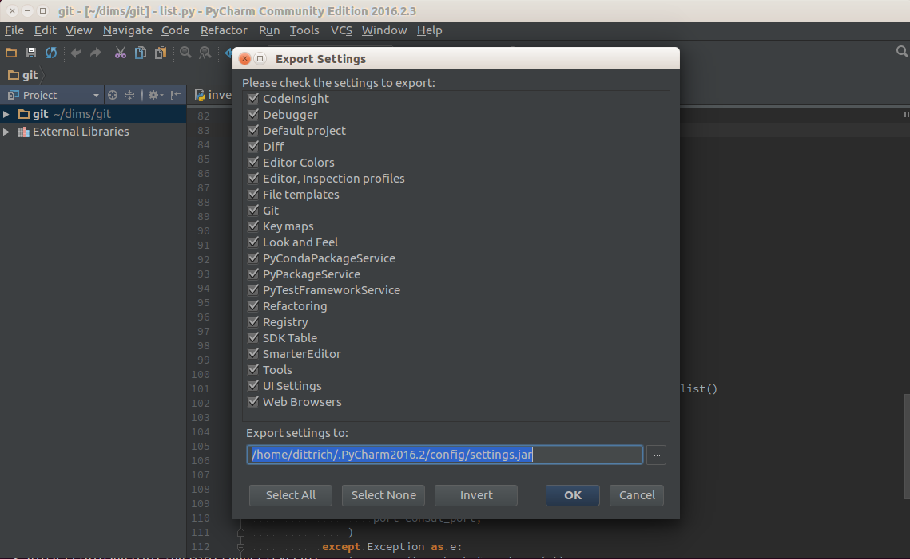
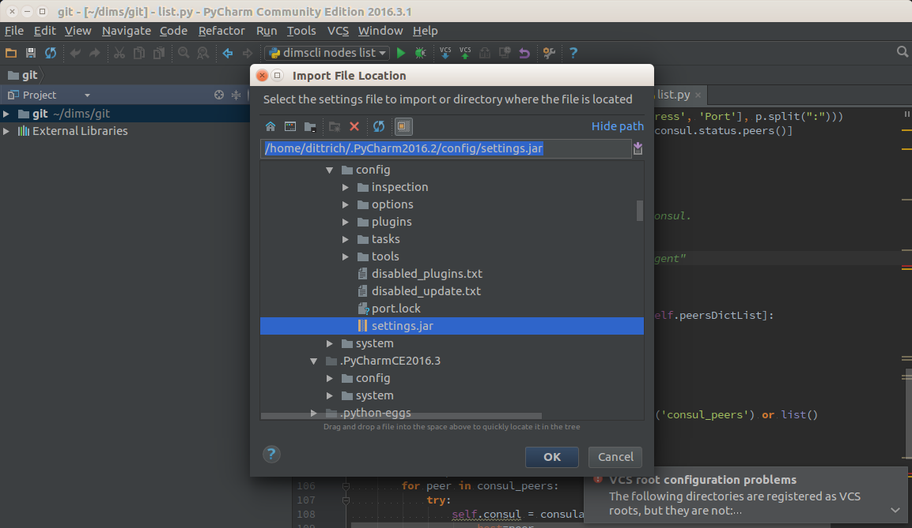

.. _debugging:

Debugging and Development
=========================

This chapter covers some tools and tactics used for testing and debugging
misbehaving system components, or obtaining sufficient detail about how
subsystem components work in order to control them to achieve project goals and
requirement objectives. Executing some command line or triggering an
action in a user interface that results in the system appearing to
"hang" can be caused by many things. Just looking at the surface and
seeing no action is useless in determining the root cause of the
issue. The ability to turn a "black box" into a "transparent box"
is invaluable to the process of testing and debugging.

.. hint::

   Some useful resources on the processes of *testing and debugging*
   are listed here:

      * `Testing and Debugging`_
      * `White-box testing, Wikipedia`_
      * `White-Box Testing`_, by Oliver Cole, March 1, 2000

..

.. _Testing and Debugging: http://www.jodypaul.com/SWE/TD/TestDebug.html
.. _White-box testing, Wikipedia: https://en.wikipedia.org/wiki/White-box_testing
.. _White-Box Testing: http://www.drdobbs.com/tools/white-box-testing/184404030

.. _filesystemeffects:

Determining File System Affects of Running Programs
---------------------------------------------------

Many programs used in the DIMS project consume gigabytes of disk storage,
often in hidden locations that are not obvious to the user. The act of
taking an Ubuntu 14.04 install ISO image, converting it with Packer
into a BOX file, turning that into a Virtualbox image, and instantiating
a Vagrant virtual machine can turn just under 1 GB into 3-5 GB of storage.
Multiply that by a dozen or more virtual machines and this quickly can
add up. If you are not aware of what gets created, and you change names
of virtual machines, you can end up with a huge amount of wasted disk
space with unused virtual disks, virtual machine images, etc.

For this reason, every programmer developing tools that use programs
like this should be methodical about understanding every process in
terms of inputs, process, and **outputs**, such that it is possible
to **see** what is produced to help the person using your tools know
what is happening, and to **undo** those effects in a controlled way
to simplify cleaning up.

.. hint::

   An easy way to help the user of your tools is to be organized and
   put large files related to a workflow like Packer->Virtualbox->Vagrant
   VM creation under a single directory path like ``/vm`` that can
   deleted in one step, backed up and moved to another system with
   a larger hard drive, or expanded by mounting a second hard drive
   onto that directory path as a mount point. Scattering the files
   across many unrelated subdirectories in random locations and
   depths within the user's ``$HOME`` directory tree makes it much
   harder to handle a situation where the hard drive on a laptop
   reaches 100% utilization.

..

Let's take a look at a portion of the workflow of Packer->Virtualbox->Vagrant
creation to see how to white-box disk utilization and space management.

We start by changing directory into the ``$GIT/dims-packer`` repository where
tools for creating Vagrants using Packer are kept. We create an initial empty
file to serve as a marker in time for then locating any files that
were created **after** this file.

.. note::

   The example here will search through a set of directories that were
   chosen based on knowledge that they exist and are used by various tools.
   To obtain this knowledge, it is often helpful to start looking at the
   root of the filesystem (``/``) and look for **any** files in **any**
   directories, which you will quickly find has a lot of unrelated file
   system additions that just happen to have been made at the same time
   as the program you were running.  A more precise way to identify
   where files are created is to trace execution of the program in
   question, following all forked children, using a program like
   ``strace`` and/or ``ltrace``, however these tools require a much
   deeper understanding of how the Unix/Linux kernel works.

..

.. code-block:: none

    $ cd $GIT/dims-packer

..

.. code-block:: none

    $ cd $GIT/dims-packer
    $ find /home/dittrich/.vagrant.d/ /home/dittrich/.packer.d/ /home/dittrich/VirtualBox\ VMs/ . /vm -newer foo -ls
    56230373    4 drwxrwxr-x   7 dittrich dittrich     4096 Mar 15 13:14 /home/dittrich/.vagrant.d/
    56230688    0 -rw-rw-r--   1 dittrich dittrich        0 Mar 15 13:14 /home/dittrich/.vagrant.d/data/machine-index/index.lock
    56230689    4 drwxr-xr-x   2 dittrich dittrich     4096 Mar 15 13:14 /home/dittrich/.packer.d/
    56230691    4 -rw-rw-r--   1 dittrich dittrich      318 Mar 15 13:14 /home/dittrich/.packer.d/checkpoint_cache
    55314574    4 drwx------   6 dittrich dittrich     4096 Mar 15 13:24 /home/dittrich/VirtualBox\ VMs/
    58589344 2183628 -rw-------   1 dittrich dittrich 2240348160 Mar 15 13:27 /home/dittrich/VirtualBox\ VMs/vagrant-run-ns1_default_1458069887689_42029/ns1_box-disk1.vmdk
    58987212    4 drwx------   2 dittrich dittrich     4096 Mar 15 13:24 /home/dittrich/VirtualBox\ VMs/devserver
    55574611    4 drwxrwxr-x  19 dittrich dittrich     4096 Mar 15 13:24 .
    58590167    4 drwxrwxr-x   2 dittrich dittrich     4096 Mar 15 13:24 ./vagrant-output
    58590705 633044 -rw-rw-r--   1 dittrich dittrich 648229139 Mar 15 13:24 ./vagrant-output/packer_devserver_box_virtualbox.box
    55574679    4 drwxrwxr-x   2 dittrich dittrich     4096 Mar 15 13:14 ./ubuntu_64_vagrant
    55574655    4 -rw-rw-r--   1 dittrich dittrich     3263 Mar 15 13:14 ./ubuntu_64_vagrant/devserver-base.json
    55574654    4 -rw-rw-r--   1 dittrich dittrich     3044 Mar 15 13:14 ./ubuntu_64_vagrant/devserver-box.json
    58590704    4 drwxr-xr-x   2 dittrich dittrich     4096 Mar 15 13:21 ./output-devserver
    58590711   12 -rw-------   1 dittrich dittrich    10629 Mar 15 13:20 ./output-devserver/devserver.ovf
    58590712 620528 -rw-------   1 dittrich dittrich 635416064 Mar 15 13:21 ./output-devserver/devserver-disk1.vmdk
    55574612    4 drwxrwxr-x   8 dittrich dittrich     4096 Mar 15 13:27 ./.git

..

.. code-block:: none

    [dimsenv] dittrich@dimsdemo1:~/dims/git/dims-packer (feature/dims-696*) $ touch foo2
    [dimsenv] dittrich@dimsdemo1:~/dims/git/dims-packer (feature/dims-696*) $ find /home/dittrich/.vagrant.d/ /home/dittrich/.packer.d/ /home/dittrich/VirtualBox\ VMs/ . /vm -newer foo2 -ls
    56230373    4 drwxrwxr-x   7 dittrich dittrich     4096 Mar 15 13:33 /home/dittrich/.vagrant.d/
    56230688    0 -rw-rw-r--   1 dittrich dittrich        0 Mar 15 13:33 /home/dittrich/.vagrant.d/data/machine-index/index.lock
    55574612    4 drwxrwxr-x   8 dittrich dittrich     4096 Mar 15 13:33 ./.git
    53346305    4 drwxr-xr-x   5 dittrich dittrich     4096 Mar 15 13:33 /vm
    53346306    4 drwxrwxr-x   2 dittrich dittrich     4096 Mar 15 13:33 /vm/devserver
    53346314    4 -rw-rw-r--   1 dittrich dittrich        1 Mar 15 13:33 /vm/devserver/.vagrant-IP
    53346310    4 -rw-rw-r--   1 dittrich dittrich        6 Mar 15 13:33 /vm/devserver/.vagrant-ISDESKTOP
    53346311    4 -rw-rw-r--   1 dittrich dittrich        7 Mar 15 13:33 /vm/devserver/.vagrant-VMTYPE
    53346312    4 -rw-rw-r--   1 dittrich dittrich        7 Mar 15 13:33 /vm/devserver/.vagrant-PLATFORM
    53346309    4 -rw-rw-r--   1 dittrich dittrich       10 Mar 15 13:33 /vm/devserver/.vagrant-NAME
    53346313    4 -rw-rw-r--   1 dittrich dittrich       32 Mar 15 13:33 /vm/devserver/.vagrant-BOXNAME
    53346316    4 -rw-rw-r--   1 dittrich dittrich       26 Mar 15 13:33 /vm/devserver/.vagrant-VAGRANTFILEPATH
    53346319    8 -rwxrwxr-x   1 dittrich dittrich     4351 Mar 15 13:33 /vm/devserver/test.vagrant.ansible-current
    53346318    8 -rw-rw-r--   1 dittrich dittrich     4245 Mar 15 13:33 /vm/devserver/Makefile
    53346315    4 -rw-rw-r--   1 dittrich dittrich        1 Mar 15 13:33 /vm/devserver/.vagrant-FORWARDPORT
    53346308    4 -rw-rw-r--   1 dittrich dittrich     2738 Mar 15 13:33 /vm/devserver/Vagrantfile
    53346307    4 -rw-rw-r--   1 dittrich dittrich     2028 Mar 15 13:33 /vm/devserver/.vagrant_show
    53346317    4 -rw-rw-r--   1 dittrich dittrich      199 Mar 15 13:33 /vm/devserver/hosts

..

.. code-block:: none

    [dimsenv] dittrich@dimsdemo1:~/dims/git/dims-packer (feature/dims-696*) $ touch foo3
    [dimsenv] dittrich@dimsdemo1:~/dims/git/dims-packer (feature/dims-696*) $ find /home/dittrich/.vagrant.d/ /home/dittrich/.packer.d/ /home/dittrich/VirtualBox\ VMs/ . /vm -newer foo3 -ls
    56230373    4 drwxrwxr-x   7 dittrich dittrich     4096 Mar 15 13:48 /home/dittrich/.vagrant.d/
    56230681    4 drwxrwxr-x   4 dittrich dittrich     4096 Mar 15 13:34 /home/dittrich/.vagrant.d/data
    56232110    0 -rw-rw-r--   1 dittrich dittrich        0 Mar 15 13:34 /home/dittrich/.vagrant.d/data/lock.dotlock.lock
    56230688    0 -rw-rw-r--   1 dittrich dittrich        0 Mar 15 13:48 /home/dittrich/.vagrant.d/data/machine-index/index.lock
    56232608    0 -rw-rw-r--   1 dittrich dittrich        0 Mar 15 13:34 /home/dittrich/.vagrant.d/data/lock.machine-action-fab0a1f680af28d59f47b677629a540a.lock
    56230682    4 drwxrwxr-x   2 dittrich dittrich     4096 Mar 15 13:35 /home/dittrich/.vagrant.d/tmp
    56230680    4 drwxrwxr-x  11 dittrich dittrich     4096 Mar 15 13:35 /home/dittrich/.vagrant.d/boxes
    58987205    4 drwxrwxr-x   3 dittrich dittrich     4096 Mar 15 13:35 /home/dittrich/.vagrant.d/boxes/packer_devserver_box_virtualbox
    58987206    4 drwxrwxr-x   3 dittrich dittrich     4096 Mar 15 13:35 /home/dittrich/.vagrant.d/boxes/packer_devserver_box_virtualbox/0
    58987207    4 drwxrwxr-x   2 dittrich dittrich     4096 Mar 15 13:35 /home/dittrich/.vagrant.d/boxes/packer_devserver_box_virtualbox/0/virtualbox
    58987202 646144 -rw-rw-r--   1 dittrich dittrich 661647360 Mar 15 13:35 /home/dittrich/.vagrant.d/boxes/packer_devserver_box_virtualbox/0/virtualbox/devserver_box-disk1.vmdk
    58987203    4 -rw-rw-r--   1 dittrich dittrich       26 Mar 15 13:35 /home/dittrich/.vagrant.d/boxes/packer_devserver_box_virtualbox/0/virtualbox/metadata.json
    58987200    4 -rw-rw-r--   1 dittrich dittrich      258 Mar 15 13:34 /home/dittrich/.vagrant.d/boxes/packer_devserver_box_virtualbox/0/virtualbox/Vagrantfile
    58987201   12 -rw-rw-r--   1 dittrich dittrich    10785 Mar 15 13:34 /home/dittrich/.vagrant.d/boxes/packer_devserver_box_virtualbox/0/virtualbox/box.ovf
    55574611    4 drwxrwxr-x  19 dittrich dittrich     4096 Mar 15 13:48 .
    55574612    4 drwxrwxr-x   8 dittrich dittrich     4096 Mar 15 13:48 ./.git
    55575296    4 -rw-rw-r--   1 dittrich dittrich     2590 Mar 15 13:48 ./make-devserver-201603151348.txt
    53346306    4 drwxrwxr-x   5 dittrich dittrich     4096 Mar 15 13:48 /vm/devserver
    53346314    4 -rw-rw-r--   1 dittrich dittrich       14 Mar 15 13:48 /vm/devserver/.vagrant-IP
    53346310    4 -rw-rw-r--   1 dittrich dittrich        6 Mar 15 13:48 /vm/devserver/.vagrant-ISDESKTOP
    53346311    4 -rw-rw-r--   1 dittrich dittrich        7 Mar 15 13:48 /vm/devserver/.vagrant-VMTYPE
    53346312    4 -rw-rw-r--   1 dittrich dittrich        7 Mar 15 13:48 /vm/devserver/.vagrant-PLATFORM
    53346309    4 -rw-rw-r--   1 dittrich dittrich       10 Mar 15 13:48 /vm/devserver/.vagrant-NAME
    53346313    4 -rw-rw-r--   1 dittrich dittrich       32 Mar 15 13:48 /vm/devserver/.vagrant-BOXNAME
    53347678    4 drwxrwxr-x  10 dittrich dittrich     4096 Mar 15 13:48 /vm/devserver/dims-keys
    53347720    0 -rw-rw-r--   1 dittrich dittrich        0 Mar 15 13:48 /vm/devserver/dims-keys/README.rd
    53347719    4 -rw-rw-r--   1 dittrich dittrich       43 Mar 15 13:48 /vm/devserver/dims-keys/.gitignore
    53347722    4 drwxrwxr-x   2 dittrich dittrich     4096 Mar 15 13:48 /vm/devserver/dims-keys/ansible-pub
    . . .
    53347752    4 -rw-rw-r--   1 dittrich dittrich      402 Mar 15 13:48 /vm/devserver/dims-keys/ssh-pub/dims_andclay_rsa.pub
    53347775    4 -rw-rw-r--   1 dittrich dittrich       79 Mar 15 13:48 /vm/devserver/dims-keys/ssh-pub/dims_eliot_rsa.sig
    53346320    4 drwxrwxr-x   3 dittrich dittrich     4096 Mar 15 13:34 /vm/devserver/.vagrant
    53346321    4 drwxrwxr-x   3 dittrich dittrich     4096 Mar 15 13:34 /vm/devserver/.vagrant/machines
    53346322    4 drwxrwxr-x   3 dittrich dittrich     4096 Mar 15 13:34 /vm/devserver/.vagrant/machines/default
    53346323    4 drwxrwxr-x   2 dittrich dittrich     4096 Mar 15 13:34 /vm/devserver/.vagrant/machines/default/virtualbox
    53346316    4 -rw-rw-r--   1 dittrich dittrich       26 Mar 15 13:48 /vm/devserver/.vagrant-VAGRANTFILEPATH
    53346318    8 -rw-rw-r--   1 dittrich dittrich     4245 Mar 15 13:48 /vm/devserver/Makefile
    53346315    4 -rw-rw-r--   1 dittrich dittrich        1 Mar 15 13:48 /vm/devserver/.vagrant-FORWARDPORT
    53346308    4 -rw-rw-r--   1 dittrich dittrich     2751 Mar 15 13:48 /vm/devserver/Vagrantfile
    53346307    4 -rw-rw-r--   1 dittrich dittrich     2041 Mar 15 13:48 /vm/devserver/.vagrant_show
    53346317    4 -rw-rw-r--   1 dittrich dittrich      212 Mar 15 13:48 /vm/devserver/hosts

..

.. code-block:: none

    $ touch foo4
    $ find /home/dittrich/.vagrant.d/ /home/dittrich/.packer.d/ /home/dittrich/VirtualBox\ VMs/ . /vm -newer foo4 -ls
    58589344 2183628 -rw-------   1 dittrich dittrich 2240348160 Mar 15 14:17 /home/dittrich/VirtualBox\ VMs/vagrant-run-ns1_default_1458069887689_42029/ns1_box-disk1.vmdk
    55574611    4 drwxrwxr-x  19 dittrich dittrich     4096 Mar 15 14:13 .
    55576829   28 -rw-rw-r--   1 dittrich dittrich    27191 Mar 15 14:13 ./Makefile
    55574612    4 drwxrwxr-x   8 dittrich dittrich     4096 Mar 15 14:13 ./.git
    53870594    4 drwxrwxr-x   5 dittrich dittrich     4096 Mar 15 14:15 /vm/vagrant-run-ns1
    53870676    4 -rw-rw-r--   2 dittrich dittrich        4 Mar 15 14:13 /vm/vagrant-run-ns1/ns1.dims
    53870676    4 -rw-rw-r--   2 dittrich dittrich        4 Mar 15 14:13 /vm/vagrant-run-ns1/ns1.local
    53346306    4 drwxrwxr-x   5 dittrich dittrich     4096 Mar 15 13:51 /vm/devserver
    53347790    4 -rw-rw-r--   1 dittrich dittrich     2756 Mar 15 13:51 /vm/devserver/Vagrantfile

..

.. _testingbranches:

Testing Code on Branches
------------------------

The DIMS development environment uses Python virtual environments on developer workstations
in order to isolate functional "production" code from more volatile development or test
quality code. This means that development code on feature branches can safely be tested
by following these basic steps:

#. Create a new Python virtual environment that is a clone of the current stable code
   base.

#. Pull the latest code from the repos to be tested, and check out the latest code.

#. Install the programs from these branches into the new Python virtual environment,
   using programs like ``dims.install.dimscommands`` and/or ``dims.ansible-playbook``
   as necessary.

#. Test the code, possibly using the ``test.runner`` script to invoke scripted tests
   that help validate the funtionality of the new code.

When you are satisfied with the tests, the Python virtual environment can safely
be deleted (or you can switch back to the "production" default ``dimsenv``
Python virtual environment) to return to using stable program code.

Let's say we are going to test the repos ``ansible-playbooks`` and ``dims-packer``,
both on the feature branch named ``feature/interfaces``.

First, create the new Python virtual environment:

.. code-block:: none

    [dimsenv] dittrich@dimsdemo1:~ () $ dimsenv.update --venv interfaces -v
    [+] NO virtual environment identified and is active
    [+] User virtual environment "interfaces" needs replacement
    [+] Running: virtualenv-clone /opt/dims/envs/dimsenv /home/dittrich/dims/envs/interfaces
    [+] Installing pre/post scripts from /opt/dims/envs into /home/dittrich/dims/envs
    [+] Processing files for /home/dittrich/dims/envs/interfaces/bin
    [+] Installed keys.host.create
    [+] Installed dyn_inv.py
    [+] Installed dims-ci-utils.update.user
    [+] Installed fix.adddeploylinks
    [+] Installed fix.ansible_managed
    [+] Installed fix.addlinks
    [+] Installed fix.addvars
    [+] Installed fix.includes
    [+] Installed fix.removetrailingspaces
    [+] Installed dims.install.createusb
    [+] Installed dims.makedocset
    [+] Installed dims.boot2docker
    [+] Installed dims.buildvirtualenv
    [+] Installed dims.bumpversion
    [+] Installed dims.jj2
    [+] Installed dims.git.repoversion
    [+] Installed dims.nas.mount
    [+] Installed dims.nas.umount
    [+] Installed dims.remote.setupworkstation
    [+] Installed dims.swapcapslockctrl
    [+] Installed dims.shutdown
    [+] Installed dims.sphinx-autobuild
    [+] Installed test.ansible.yaml
    [+] Installed test.md5.output
    [+] Installed test.supervisor
    [+] Installed test.yaml.validate
    [+] Installed dims.localcluster.create
    [+] Installed dims.localcluster.start
    [+] Installed dims.localcluster.stop
    [+] Installed dims.localcluster.destroy
    [+] Installed dims.localcluster.status
    [+] Installed dims.localcluster.runscript
    [+] Installed dims.clusterconfig.nas
    [+] Installed dims.clusterconfig.local
    [+] Installed dims.clusterconfig.list
    [+] Installed dims.cluster.runscript
    [+] Installed dims.elasticsearch.service
    [+] Installed test.vagrant.ansible-current
    [+] Installed test.vagrant.factory
    [+] Installed test.vagrant.list
    [+] Installed test.packer.factory
    [+] Installed test.packer.list
    [+] Installed test.vagrant.listvms
    [+] Successfully installed 43 programs
    [-] To enable the interfaces virtual environment, do "exec bash" or log out/log in

..

Activate the new virtual environment:

.. code-block:: none

    [dimsenv] dittrich@dimsdemo1:~ () $ workon interfaces
    [+] Virtual environment 'dimsenv' activated [ansible-playbooks v1.3.33]
    [interfaces] dittrich@dimsdemo1:~ () $

..

Update the first repo and check out the desired branch for testing.

.. code-block:: none

    [interfaces] dittrich@dimsdemo1:~ () $ cd $GIT/ansible-playbooks
    [interfaces] dittrich@dimsdemo1:~/dims/git/ansible-playbooks (develop*) $ git hf update && git hf pull && git checkout feature/interfaces
    Fetching origin
    remote: Counting objects: 71, done.
    remote: Compressing objects: 100% (44/44), done.
    remote: Total 44 (delta 33), reused 0 (delta 0)
    Unpacking objects: 100% (44/44), done.
    From git.devops.develop:/opt/git/ansible-playbooks
       d3ae79a..cd789e9  develop    -> origin/develop
     * [new branch]      feature/interfaces -> origin/feature/interfaces
    Summary of actions:
    - Any changes to branches at origin have been downloaded to your local repository
    - Any branches that have been deleted at origin have also been deleted from your local repository
    - Any changes from origin/master have been merged into branch 'master'
    - Any changes from origin/develop have been pulled into branch 'develop'
    - Any resolved merge conflicts have been pushed back to origin
    - You are now on branch 'develop'
    Fetching origin
    Summary of actions:
    Branch feature/interfaces set up to track remote branch feature/interfaces from origin by rebasing.
    Switched to a new branch 'feature/interfaces'
    [dimsenv] dittrich@dimsdemo1:~/dims/git/ansible-playbooks (feature/interfaces*) $

..

Update the subsequent repo(s), as necessary, and check out the desired branch for testing.

.. code-block:: none

    [interfaces] dittrich@dimsdemo1:~/dims/git/ansible-playbooks (feature/interfaces*) $ cd $GIT/dims-packer
    [interfaces] dittrich@dimsdemo1:~/dims/git/dims-packer (feature/interfaces*) $ git hf update && git hf pull && git checkout feature/interfaces
    Fetching origin
    remote: Counting objects: 72, done.
    remote: Compressing objects: 100% (55/55), done.
    remote: Total 61 (delta 30), reused 0 (delta 0)
    Unpacking objects: 100% (61/61), done.
    From git.devops.develop:/opt/git/dims-packer
       069d966..2d47264  feature/interfaces -> origin/feature/interfaces

    Summary of actions:
    - Any changes to branches at origin have been downloaded to your local repository
    - Any branches that have been deleted at origin have also been deleted from your local repository
    - Any changes from origin/master have been merged into branch 'master'
    - Any changes from origin/develop have been merged into branch 'develop'
    - Any resolved merge conflicts have been pushed back to origin
    - You are now on branch 'feature/interfaces'
    Fetching origin
    Updating 069d966..2d47264
    Fast-forward
     Makefile-vagrant.j2                                                           |  2 +-
     Vagrantfile.j2                                                                | 23 ++++++++++++++---------
     scripts/all/create-network-interfaces.sh                                      | 17 +++++++++++++----
     scripts/all/{network-capture.sh => network-debug.sh}                          |  1 -
     scripts/jessie/after-up/00-create-network-interfaces.sh                       |  1 +
     scripts/{xenial/post-provision.sh => jessie/after-up/05-jessie-networking.sh} | 22 +++++++++++++++++-----
     scripts/jessie/after-up/10-network-debug.sh                                   |  1 +
     scripts/jessie/post-provision.sh                                              | 42 ------------------------------------------
     scripts/trusty/after-up/00-create-network-interfaces.sh                       |  1 +
     scripts/trusty/after-up/10-network-debug.sh                                   |  1 +
     scripts/trusty/post-provision.sh                                              | 42 ------------------------------------------
     scripts/wheezy/after-up/00-create-network-interfaces.sh                       |  1 +
     scripts/wheezy/after-up/10-network-debug.sh                                   |  1 +
     scripts/wheezy/post-provision.sh                                              | 42 ------------------------------------------
     scripts/xenial/after-up/00-create-network-interfaces.sh                       |  1 +
     scripts/xenial/after-up/10-network-debug.sh                                   |  1 +
     test.vagrant.factory                                                          | 62 ++++++++++++++++++++++++++++++++++----------------------------
     17 files changed, 87 insertions(+), 174 deletions(-)
     rename scripts/all/{network-capture.sh => network-debug.sh} (99%)
     create mode 120000 scripts/jessie/after-up/00-create-network-interfaces.sh
     rename scripts/{xenial/post-provision.sh => jessie/after-up/05-jessie-networking.sh} (68%)
     create mode 120000 scripts/jessie/after-up/10-network-debug.sh
     delete mode 100755 scripts/jessie/post-provision.sh
     create mode 120000 scripts/trusty/after-up/00-create-network-interfaces.sh
     create mode 120000 scripts/trusty/after-up/10-network-debug.sh
     delete mode 100755 scripts/trusty/post-provision.sh
     create mode 120000 scripts/wheezy/after-up/00-create-network-interfaces.sh
     create mode 120000 scripts/wheezy/after-up/10-network-debug.sh
     delete mode 100755 scripts/wheezy/post-provision.sh
     create mode 120000 scripts/xenial/after-up/00-create-network-interfaces.sh
     create mode 120000 scripts/xenial/after-up/10-network-debug.sh

    Summary of actions:
    - Any changes from origin/feature/interfaces have been pulled into branch 'feature/interfaces'
    Already on 'feature/interfaces'
    Your branch is up-to-date with 'origin/feature/interfaces'.
    [interfaces] dittrich@dimsdemo1:~/dims/git/dims-packer (feature/interfaces*) $

..

Now that both repos have been pulled, and their respective ``feature/interfaces`` branches
checked out, install any updated programs to be tested:

.. code-block:: none

    [interfaces] dittrich@dimsdemo1:~/dims/git/dims-packer (feature/interfaces*) $ dims.install.dimscommands -v
    [+] Processing files for /home/dittrich/dims/envs/interfaces/bin
    [+] Installed test.vagrant.factory
    [+] Successfully installed 1 program

..

.. _debuggingvagrant:

Debugging Vagrant
-----------------

`Vagrant`_ is used to create and destroy Virtual Machine sub-systems within
DIMS deployments. It is designed to create replicable development environments,
but is also being used to instantiate replica DIMS deployments to facilitate
not only development, but also testing and isolation of deployments to exercise
and document system administration tasks.

Vagrant, like Ansible and some other open source tools used in the DIMS project,
sometimes are sparse on documentation, especially of advanced features necessary
for small-scale distributed systems deployment. This can make debugging harder,
since the functionality is wrapped in a black box that is the ``vagrant`` command
line (which may be buried within a ``Makefile`` and/or Bash script.)

.. _vagrantprovisioners:

Verbosity in Vagrant Provisioners
^^^^^^^^^^^^^^^^^^^^^^^^^^^^^^^^^

The first way to turn this black box into a white box is to enable debugging
within the provisioners being called, such as the ``ansible`` provisioner.
To do this, the ``Vagrantfile`` produced by DIMS scripts allows an environment
variable ``VERBOSITY`` to be passed to the ``ansible`` provisioner:

.. code-block:: ruby

    . . .
    ANSIBLE_VERBOSITY = ENV['VERBOSITY'].nil? ? "vv" : ENV['VERBOSITY']
      . . .
      config.vm.provision "ansible" do |ansible|
        . . .
        # Use the environment variable VERBOSITY to change verbosity level.
        ansible.verbose = ANSIBLE_VERBOSITY
        . . .
      end
    . . .

..

This mechanism adds verbosity to the provisioner being called **by**
Vagrant, but does nothing to help you see what Vagrant itself is doing
before and after the ``ansible`` provisioner is called.

.. _vagrantlogging:

Vagrant Debug Logging
^^^^^^^^^^^^^^^^^^^^^

To get debugging output from Vagrant itself, there is another
environment variable that produces log output from Vagrant
onto ``stderr``, which can be redirected to a file for examination
(shown here is the context of a GNU ``Makefile``):

.. code-block:: none

    #HELP up - Do 'vagrant up --no-provision'
    .PHONY: up
    up:
	    @if [ "$(VAGRANT_STATUS)" != "running" ]; then \
	        echo "[+] vagrant up --no-provision"; \
	        VAGRANT_LOG=debug vagrant up --no-provision 2>/tmp/vagrant-$(FQDN).log; \
	     fi

..

The output is quite voluminous and shows not only what Vagrant is doing
internally, but also how it is calling programs like ``vboxmanage`` to
manipulate the Vagrant Virtual Machine.

.. code-block:: none

    . . .
     INFO global: Vagrant version: 1.8.6
     INFO global: Ruby version: 2.2.5
     INFO global: RubyGems version: 2.4.5.1
     INFO global: VAGRANT_LOG="debug"
    . . .
     INFO subprocess: Starting process: ["/usr/bin/VBoxManage", "sharedfolder", "add", "16425ef3-0e00-4c8e-89aa-116065f1cb36", "--name", "home_ansible_vagrant", "--hostpath", "/vm/run/blue14"]
     INFO subprocess: Command not in installer, restoring original environment...
    DEBUG subprocess: Selecting on IO
    DEBUG subprocess: Waiting for process to exit. Remaining to timeout: 32000
    DEBUG subprocess: Exit status: 0
     INFO subprocess: Starting process: ["/usr/bin/VBoxManage", "setextradata", "16425ef3-0e00-4c8e-89aa-116065f1cb36", "VBoxInternal2/SharedFoldersEnableSymlinksCreate/home_ansible_sources", "1"]
     INFO subprocess: Command not in installer, restoring original environment...
    DEBUG subprocess: Selecting on IO
    DEBUG subprocess: Waiting for process to exit. Remaining to timeout: 32000
    DEBUG subprocess: Exit status: 0
     INFO subprocess: Starting process: ["/usr/bin/VBoxManage", "sharedfolder", "add", "16425ef3-0e00-4c8e-89aa-116065f1cb36", "--name", "home_ansible_sources", "--hostpath", "/vm/cache/sources"]
     INFO subprocess: Command not in installer, restoring original environment...
    DEBUG subprocess: Selecting on IO
    DEBUG subprocess: Waiting for process to exit. Remaining to timeout: 32000
    DEBUG subprocess: Exit status: 0
    . . .

..

.. caution::

    Remember that environment variables, once set, are inheritted by all child
    processes (unless they are **unset** before another sub-process is started).
    Using an environment variable to enable logging in a program means that
    not only the initial process running the ``vagrant`` program, **but all
    child processes created by this parent process** that also run ``vagrant``
    will have debugging output on ``stdout``.  If the ``Vagrantfile`` itself
    instructs ``vagrant`` to directly run ``vagrant``, the parent process will
    receive this output on ``stderr`` and may interpret it to mean "failure"
    when there is actually no real error.

    .. code-block:: ruby

        # Shell provisioner to do post-provisioning actions
        # See https://github.com/emyl/vagrant-triggers/wiki/Trigger-recipes
        config.trigger.after [:provision], :stdout => true do
          run "vagrant ssh -c '/opt/dims/bin/trigger.runner --state after-provision'"
        end

    ..

    In this case, make sure that ``:stderr => false`` is included on the
    trigger configuration line to either prevent output to ``stderr`` and/or
    config non-error exit code values.

..

.. _vagrantsource:

Use the Source, Luke
^^^^^^^^^^^^^^^^^^^^

Lastly, you may need to read the Vagrant source code itself to find
out how Vagrant operates. For example, the file ``vagrant/plugins/providers/virtualbox/action/network.rb`` shows the defaults used by Vagrant for Virtualbox virtual
networking using DHCP:

.. code-block:: ruby

        #-----------------------------------------------------------------
        # DHCP Server Helper Functions
        #-----------------------------------------------------------------

        DEFAULT_DHCP_SERVER_FROM_VBOX_INSTALL = {
          network_name: 'HostInterfaceNetworking-vboxnet0',
          network:      'vboxnet0',
          ip:           '192.168.56.100',
          netmask:      '255.255.255.0',
          lower:        '192.168.56.101',
          upper:        '192.168.56.254'
        }.freeze

..

This shows the default range for dynamically assigned addresses (which you will
want to avoid using for any static addresses on the same network to avoid
possible conflicts.)

The source code, a few lines lower, also shows what and how Vagrant will log
the fact that it is creating a DHCP server to manage addresses:

.. code-block:: ruby

          @logger.debug("Creating a DHCP server...")
          @env[:machine].provider.driver.create_dhcp_server(interface[:name], config)

..

The string "Creating a DHCP server..." is what you would look for in
the log output produced by setting the ``VAGRANT_LOG`` environment
variable as described earlier.

.. todo::

    Not done yet...

..

.. _Vagrant: https://www.vagrantup.com/
.. _mitchellh/vagrant: https://github.com/mitchellh/vagrant

.. _updatingpycharm:

Updating PyCharm Community Edition
----------------------------------

PyCharm keeps all of its state, including settings, breakpoints, indexes, in internal
data stores in a directory specific to the version of PyCharm being used.  For example,
PyCharm 2016.2.3 files are kept in ``$HOME/.PyCharm2016.2``. When updating to the
release ``2016.3.1``, the location changes to ``$HOME/.PyCharmCE2016.3``. You need
to run PyCharm ``2016.2.3`` to export your settings, then run the new PyCharm
``2016.3.1`` version to import them.

To export settings, run PyCharm ``2016.2.3`` and select **File>Export
Settings...**. A dialog will pop up that allows you to select what to export and
where to export it. You can use the defaults (pay attention to where the exported
setting file is located, since you need to select it in the next step.) Select
**Ok** to complete the export. See Figure :ref:`exportsettings`.

.. _exportsettings:

   Exporting Settings from PyCharm 2016.2.3

..

PyCharm is installed using Ansible. The normal workflow for updating a component
like PyCharm is to test the new version to ensure it works properly, then update
the variables for PyCharm in the Ansible ``inventory`` before exporting your old
settings and then running the ``pycharm`` role for your development system.

.. TODO(dittrich): Add a cross-reference to running the playbook
.. todo::

    Add a cross-reference to running the playbook.

..

After PyCharm has been updated, select **File>Import Settings...** and select
the ``.jar`` file that was created in the previous step and then select **Ok**.
Again, the defaults can be used for selecting the elements to import.
See Figure :ref:`importsettings`.

.. _importsettings:

   Importing Settings to PyCharm 2016.3.1

..

Once you have completed this process and are successfully using version ``2016.3.1``,
you can delete the old directory.

.. code-block:: none

   $ rm -rf ~/.PyCharm2016.2

..

